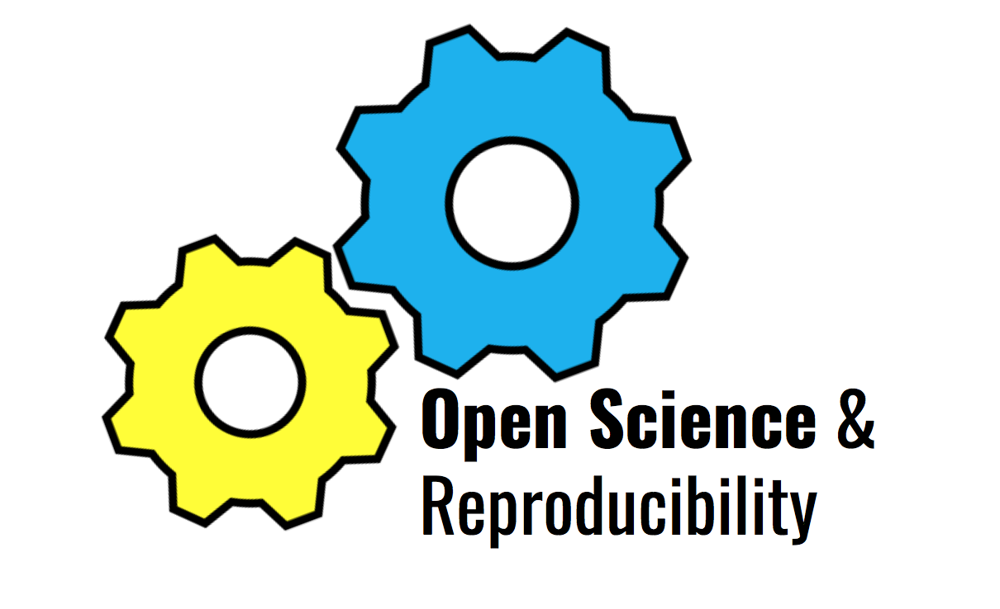

```{r setup, include=FALSE}
knitr::opts_chunk$set(echo = TRUE)
```

<br/>

<center>
{width=60%}
</center>

<br/><br/>


# Further Suggestions and Ideas

Do you like the idea of open science? Then start getting involved. Here are a few more ideas of what you can do to contribute to a more open research environment:

<br/>

* **Preregister your study:** learn more about what [pregistration](https://en.wikipedia.org/wiki/Preregistration_(science)) involves. 
* **Document the exact versions** of all external programms, packages, … used. 
* **Publish preprints** and make sure your papers are open source
* **Participate in Open Peer Review:** which may included non-blinded peer review,  'open reports', that is pubsidhing reviews alongside the article, 'open interaction' where direct reciprocal discussion between authors and reviewrs is encourages. Have a look at the [Opennes Initiative](https://www.opennessinitiative.org)'s information on it. 
* **Set seeds** for analyses that include randomness, since since only [seeds](https://towardsdatascience.com/how-to-use-random-seeds-effectively-54a4cd855a79) allow for exact matching of numbers


