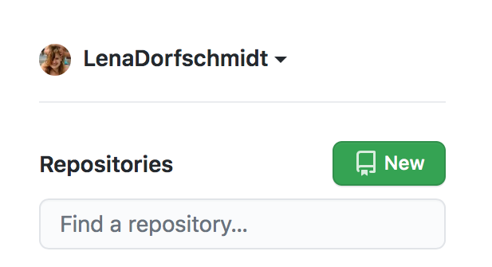
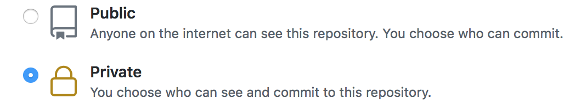
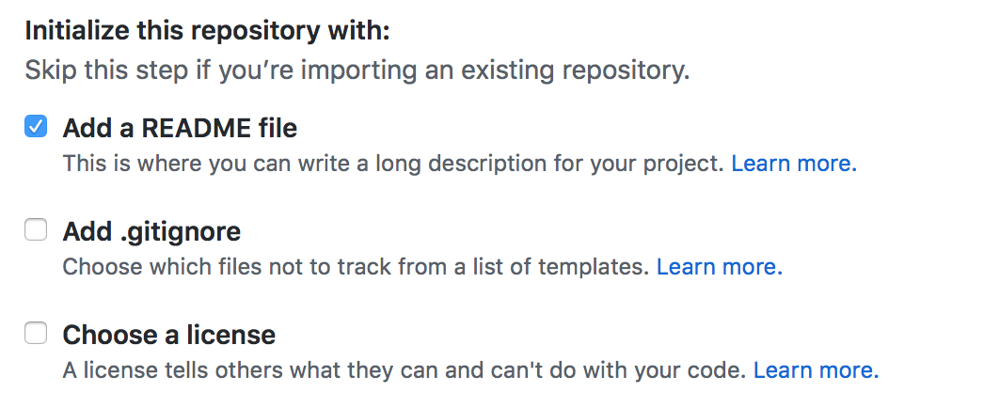
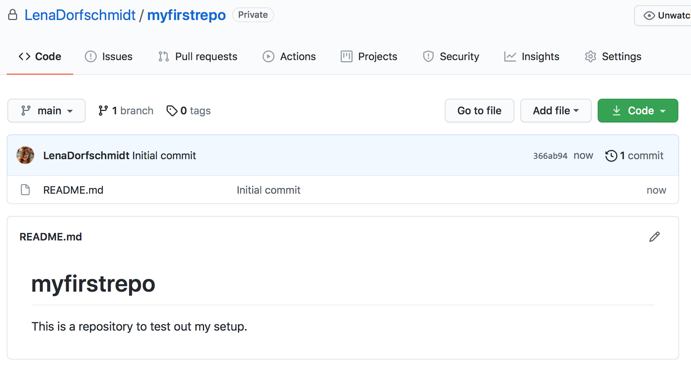
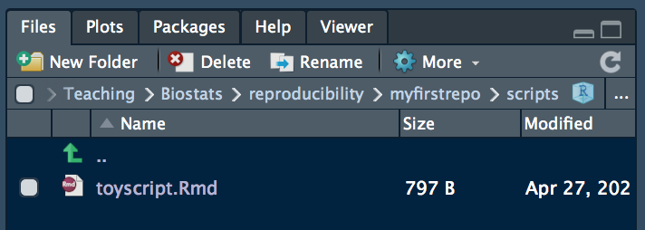
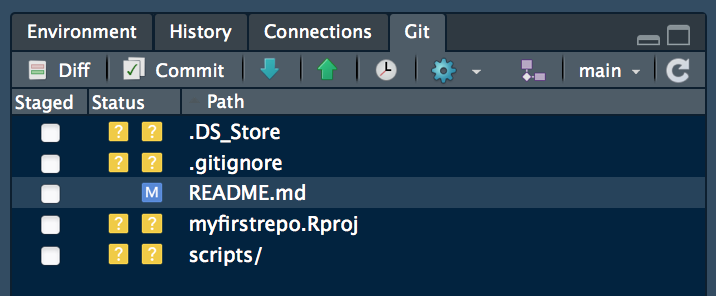
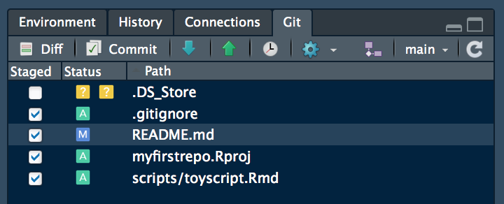
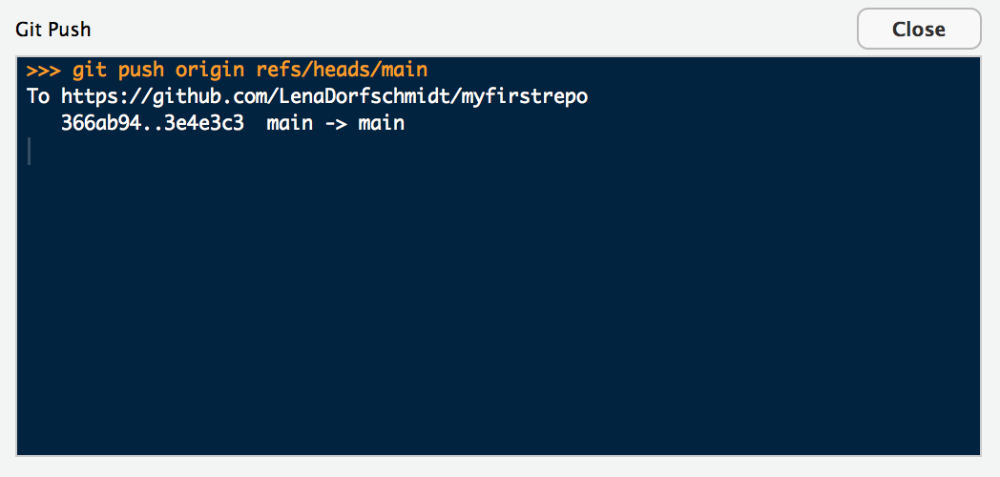

---
output:
  html_document: 
    toc: true
    toc_float: true
    toc_depth: 6
---
```{r setup, include=FALSE}
htmltools::tagList(rmarkdown::html_dependency_font_awesome())
```

<br /> <br />

<p align="center">
<iframe src="https://docs.google.com/presentation/d/e/2PACX-1vQpzxV_-Jmz4tIhPA3BsO7p_mxDVMqkODyJYPos1cghlkUX8nY_Z7YTV7NFzcKI1gKt8bEQGySRnDaA/embed?start=false&loop=false&delayms=3000" frameborder="0" width="672" height="398" allowfullscreen="true" mozallowfullscreen="true" webkitallowfullscreen="true"></iframe>
</p>

<br /> <br />

:::: {.summarybox data-latex=""}
:::: {.summarybox-title }
<font size="5"> 
<i class="fas fa-question-circle"></i> **Overview**
</font> 
::::

1. You will understand the benefits of an automated version control system. 
2. You will setup your **first git repository**. 
3. You will gain an understandig of how to use git to track *your own* changes to your project. 
::::

<br /> <br />


# Version Control
***

Version control is a system that allows you to keep track of changes done to your files. Here, we will focus on how to use git/GitHub to track *your own* changes to your project, but distributed version control systems like gitHub can also be used to collaborate on projects. Check out this [resource](https://swcarpentry.github.io/git-novice/08-collab/index.html) if you'd like to learn more about how to use git/GitHub for collaboration.

<br /><br />

# Setup Git
***

## Installation

First, let's figure out if you already have git installed. Go to the shell and enter `which git` to request the path to your Git executable:

````markdown
which git
## /usr/bin/git
````

If this is successfull: great! Move on to the next section. If not, then you should install git. 

### Mac
If you have homebrew installed, you can type `brew install git` in the command line. Should you not have homebrew installed, you can also install git from here: http://git-scm.com/downloads

### Windows

For windows users, I'd recommend you install [Git for Windows](https://gitforwindows.org). Use the default settings except for when asked about 'When asked about 'Adjusting your PATH environment': Here, select ', make sure to select 'Git from the command line and also from 3rd-party software'.

### Linux

On Linux, you can install git by typing `sudo apt-get install git`. 

Done? Perfect, let's move on. 

<br /><br />

## Introduce yourself to git

We now need to tell git who you are. In the shell type: `git config --list --show-origin`. Git will tell you know what it already knows about you. If the `user.name` and `user.email` already show your git username and the email address you used to setup your account, you are done and can move one. If not, in the shell, enter the following. Substitue `YourUsername` and `you@emailaddress.com` with the information used for setting up your git account. 

````markdown
git config --global user.name 'YourUsername'
git config --global user.email 'you@emailaddress.com'
````

Use `git config --list --show-origin` again to check this worked out. 

<br />

# Creating a git repository on GitHub 
***

One easy way to create a git repository is to manually do so on GitHub. That's how we will create our first repository. Go to https://github.com and log in. 

At the top left, click on 'New' to create a new repository. 

<br />

{width=20%}

<br />

Now, choose a name and a short description for your new repository. 
  
<br />  

{width=40%}

<br />

You can choose whether you want your repository to be private or public. I personally tend to keep my repositories private until I get ready to publish my analyses. 

<br />

{width=40%}

<br />

Lastly, we'll click on 'add README' so we don't have to create this later. README's are a great way to describe what your repository is meant to do - you can add a lot of detail to this (check out a few repos on GitHub to see what people do), if you like, but at least give some basic indications on how things work.  

<br />

{width=40%}

<br />

Click on 'Create Repository' and you are done!

<br />

{width=40%}

<br /><br />

# Setting up git in R Studio
***

R Studio has a very useful feature which allows you to interact with your git repository from within R Studio, rather than having to revert to the shell or an external interface. Let's setup that feature. 

<br />

## Install required packages

Install `usethis`. 

````markdown
install.packages('usethis')
````

<br />

## Create a personal access token

To make your life easier and prevent having to enter your password and user name every time you commit to git, we will create a personal access token. 

<br />

## Clone the repository 

Until now, you repository only exists online on GitHub. We need to get it from there onto your local machine. This process is called 'cloning'. To ‘clone’ means to make a local copy of a remote GitHub repository. This only needs to be done once.

<br />

### Copy the GitHub repository's URL

Got to the repository we just created on GitHub. Copy the URL. This should be `https://github.com/YourUsername/RepositoryName` where `YourUsername` is your GitHub username and `RepositoryRame` is the name you chose for your repository. 

<br />

{width=40%}

<br />

### Create a new project

Click on `File > New Project > Version Control > Git`. A window will popup that allows you to specify where on GitHub R Studio should look for the repoistory. 

In the 'Repository URL' field paste the URL from your GitHub repository. Make sure that the Project directory name is the same as the GitHub repository (e.g above 'myfirstrepository'). Make sure to choose the directory for you repository intentionally (and no, 'Desktop' and 'Downloads' are not acceptable options).

<br />

{width=40%}

<br />

Clicking on 'Create Project' will create a new directory on your computer which will include:

* a directory linked to a remote GitHub repository
* an RStudio Project file (`.Rproj`)
* a `README.md` file with information about the the project
* a `.gitignore` file listing all files not to be tracked (more on this one later)

<br /><br />

# Use git in R Studio
***

When you clone a repository from GitHub, all files included are downloaded onto your computer. Since the repository we created on GitHub only included the README.md file, that's all that was clone. Do practice the git workflow, let's populate the repository. 

<br />

## Create a folder structure

Let's start with a good file structure right from the beginning. Drawing from the first session on this course, go ahead and create a folder structure for you project. I usually at least create folders for `data`, `scripts` and `results`. You can do this directly in R Studio by clicking on 'Files - New Folder'.

<br />

{width=40%}

<br />

## Create files

For the fun of it, let's create the first script in our repository. I created an R Markdown document ('File - New File - R Markdown...') and saved it into the 'scripts' folder in this repository I created earlier. Note how you can navigate through the folders in your repository in the 'File' tab in R Studio. 

I.e. here I have navigates into said 'scripts' folder:

<br />

{width=40%}

<br />

## Edit your scripts

Let's make an edit to an already existing file. Open the README.md and add a line of text to it. Then save it. 

<br />

{width=40%}

<br />
 
## Push our changes

Now that we have done some changes to our local repository, we want to 'push' them to the remote repository. Basically, we are telling the remote repository 'Hey, I here are the changes I have done, please integrate them into your version of the repository!'.

This workflow consists of three stages:

1. **Staging:** Select the files to be pushed. To do so, click on 'Git' at the top right. 

<br />

{width=40%}

<br />

R Studio will show you all files that have been changed since your last commit. Select the files you'd like to commit to the remote repository by clicking on the boxes under 'Staged'. R Studio is helping you here, by displaying little blue 'M's to indicate a file has been '*M*odified'; yellow '?' indicate untracked file; green 'A's mean '*A*dded'. 

<br />

{width=40%}

<br />

2. **Committing:** Committing consists on reviewing, commenting and accepting the changes before pulling the new version of the file into the remote repository. 

Click on 'Commit'. A new window will appear where added code is shown in green whereas the deleted code is in red. Make sure to add a comment describing what changes you have made to your commit. This is particularly helpful should you ever want to revert to earlier versions of you repository, for example when debugging.

Once ready, click on 'Commit'.

<br />

{width=50%}

<br />

3. **Pushing:** Pushing takes your 'commit' and transfers those changes to the remote repository. 


<br />

{width=50%}

<br />

Congratulations, you have just made your first commit!

<br />

:::: {.taskbox data-latex=""}
:::: {.taskbox-title }
<font size="5"> 
<i class="fas fa-exclamation-circle"></i> **Summary**
</font>
::::

1. git/GitHub is a powerful distributed version control system that allows you to track the history of changes to your work. Version control is like an unlimited ‘undo’.
2. R Studio allows you to directly interact with git. How convenient!
::::

# Further Resources
***

Version control also allows many people to work in parallel. To start **collaborating** on projects using git/GitHub, checkout this [resource](https://swcarpentry.github.io/git-novice/08-collab/index.html).

If you wanted to appear more 'pro coder'-like could consider learning how to use git from the command line. [This resource](https://rviews.rstudio.com/2020/04/23/10-commands-to-get-started-with-git/) may be a good start, since it directly 'translates' from the clicking we just did in R Studio to the shell commands. 


