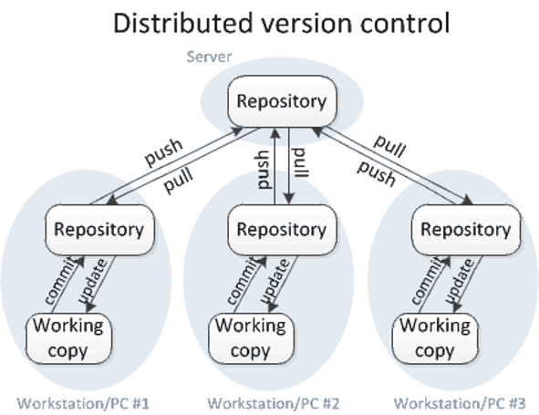

---
output:
  html_document: 
    toc: true
    toc_float: true
    toc_depth: 6
---

# Version Control Systems

A version control system is a system which keeps track of the history/changes/versions of a file making it easier for multiple people to work on the same project at the same time.  This gives them the possibility of comparing changes between different versions of the file, move back to an previous version of a file if needed, keep track on who,when and why someone in the team made changes to a file. 
<!--animation of versioning -->
<!--http://swcarpentry.github.io/git-novice/01-basics/index.html-->

This system is popular in the software development industry as it allows teams to have a common location or **repository** where all the source code/files in the project are kept and thus are able to work on an updated version of the project.

Version control systems are also popular as they prevent the situation of loosing all your work if your computer breaks down.  Most probably you have already been using a kind of version control without realising by renaming your files.

<!--http://phdcomics.com/comics.php?f=1531-->

A version control system will be keeping versions for each file in the repository behind the scenes, so you do not need to worry about renaming files, etc...

Version control systems are often categorised as either **centralised** version control systems or **distributed** version control systems.  

\  

## Centralised Version Control Systems
A centralised version control system has only one copy of the project held in a central place (server) which also keeps track of the files' history (versions). The people working on the project would be able to **commit** or make changes to the central server. Normally multiple people are not able to work on the same file simultaneously.
<!-- They normally also have the file locking feature so that if multiple users are trying to modify the same file they are warned -->
Examples of centralised version control systems are CVS and Subversion (SVN).  Distributed version control systems are becoming increasingly more popular as they overcome some of the limitations imposed by centralised version control systems.  

\  

## Distributed Version Control Systems

In a distributed version control system each person in a team working on the project makes a copy or **clones** the repository on their own computer which also includes the full history of the different files inside the repository.  Thus if a server dies, it would be able to be restored back from the copies of the repositories held by the different people in the team.

In this course we will be learning about **git** which is an example of a distributed version control system.  

\  

# What is Github?

It is important to distinguish between git and GitHub.  git is the version control system - the tool needed to keep track of your files/repositories history.  On the other hand, GitHub is a hosting platform where you can keep your files/repositories in. 

The best way to understand this clearly is by seeing this in action and working through an example together.  There are several ways you can keep versions of your files through git and GitHub and we will be looking at two popular ways in this course; using the GitHub website and using Rstudio.

\  

# Version Control through the GitHub website

In this section we will use GitHub and manage our project online without using any coding.  

The first step is to create a repository.  The slides below provide step by step instructions on how to do this.

<iframe src="https://docs.google.com/presentation/d/e/2PACX-1vQ0VHWripOuP0wNye8q-HpIHfLGAQSi_QTlrcEAIET8kSx8g3XDY83201-OVg4muCdZIr4-CcQ21iFr/embed?start=false&loop=false&delayms=3000" frameborder="0" width="820" height="480" allowfullscreen="true" mozallowfullscreen="true" webkitallowfullscreen="true"></iframe>

After this example we have now a repository in place where anyone can see the files. 

\  

# Project management in GitHub

GitHub integrates project management features to help its users manage their repositories.  This is especially helpful if these involve the collaboration of more than one person.  As the name suggests, project management allows the initiating, planning, executing, controlling, and closing the work of a team to achieve specific goals at the specified time [[Wikipedia](https://en.wikipedia.org/wiki/Project_management)].  More information on Project Management on GitHub can be found at: 

* [https://github.com/features/project-management](https://github.com/features/project-management)
* [https://help.github.com/en/github/managing-your-work-on-github](https://help.github.com/en/github/managing-your-work-on-github)

\

## Adding Collaborators

If you are working on a project in a team or with collaborators than it would be more useful to either add collaborators to your repository or else create an organisation and add members to your organisation.  Creating an organisation in GitHub is useful if you want to manage access to the different team individuals and when you have more than one repository.  More information about how to setup an Organisation on GitHub can be found [here](https://help.github.com/en/github/setting-up-and-managing-organizations-and-teams).  In this course we will be looking at how to add collaborators to your repository.  

<iframe src="https://docs.google.com/presentation/d/e/2PACX-1vR_Hmo4XUWHTIgVAY7clbFIPRvO-FVLfJMxBT4D5JjgiT34RhteOBP_qn9Vp8oXRPQtObnqbqmKG-ek/embed?start=false&loop=false&delayms=3000" frameborder="0" width="820" height="480" allowfullscreen="true" mozallowfullscreen="true" webkitallowfullscreen="true"></iframe>

\

## Issues

In GitHub, Issues are created to suggest an idea, improvements or keep track of bugs, in other words, it can be viewed as a task list for the project.  The steps involved to create an Issue on GitHub are:

<iframe src="https://docs.google.com/presentation/d/e/2PACX-1vRAAAzpAWQTFhcSxq4Vtz0Z_XrXam5ZykWXA56BaucHwCjrJeESPyv37yjhD1SGDR1gcw9ac7rA2SUi/embed?start=false&loop=false&delayms=3000" frameborder="0" width="820" height="480" allowfullscreen="true" mozallowfullscreen="true" webkitallowfullscreen="true"></iframe>

\

## Project Board

GitHub provides project boards to help manage the issues and other tasks related to the project.  GitHub allows the user to specify a project template for the project board (details of the different templates can be found [here](https://help.github.com/en/github/managing-your-work-on-github/about-project-boards#templates-for-project-boards)).  One of the most popular style of project management methodolody is **Kanban**.    Kanban is an agile methodology where the testing and build phase are integrated in the same iteration as programming rather than having them as separate phases as done in traditional methodologies.  In its simple form, the Kanban methodology is a kanban board composed of 3 columns:

1. To do
2. In progress
3. Done  

The tasks in a project are represented by cards, with each card representing one task.  The tasks start from the first column (To do) and they are pulled along the right (subsequent columns) as the task progresses through the workflow (known as a pull system).  The Kanban method focuses on having a work in progress list as small as possible so that the workforce is focused on finishing tasks with high priority. It is also emphasises on representing the tasks visually on the kanban board, allowing team members to see the status of the project at any time. If you are interested to understand the Kanban methodology better there are a good set of short videos about this [here](https://www.atlassian.com/agile/kanban).      

Let us try to create a project board on GitHub together:

<iframe src="https://docs.google.com/presentation/d/e/2PACX-1vS02IyjD_9w1NCk7RNmGsLKnAtlTrDNg-5q9cGrv3fuazMY7i3ZuU-A2GMn_qhXttQwea0YyrBUIEsV/embed?start=false&loop=false&delayms=3000" frameborder="0" width="820" height="420" allowfullscreen="true" mozallowfullscreen="true" webkitallowfullscreen="true"></iframe>

More information about project boards on GitHub can be found at [https://help.github.com/en/github/managing-your-work-on-github/managing-project-boards](https://help.github.com/en/github/managing-your-work-on-github/managing-project-boards).  

\

## The GitHub flow
<!-- this needs updating with the status of the project board -->
<!-- https://nvie.com/posts/a-successful-git-branching-model/ -->
Making changes to a repository that only yourself is contributing to is one thing.  However, when working in teams especially one which involves a large number of people where everyone is making changes to the same repository you want to have a stable **branch** in place.

A **branch** means a copy of your repository where you can make changes to without getting worried that you will do something wrong that will effect the remaining of the team.  Therefore you are free to experiment on your own branch.  There are several different workflows, *e.g.,* git-flow, GitHub flow and GitLab flow.

It is not the scope of this course to get into details about the different software development versioning models.  However, we will look briefly at GitHub flow which is one of the simple workflows available, with the aim to understand the basic constructs of software development versioning models so that we can adopt some good practices when sharing code or working in teams.  

<!-- https://githubflow.github.io/ -->
<!-- https://guides.github.com/introduction/flow/ -->
<!-- https://flowcanon.com/software/choosing-the-best-git-branching-strategy-for-your-team/ -->

The GitHub flow steps consist of the following:

* **Anything in the `master` branch is deployable**:  The `master` branch is the main branch which reflects what is deployed.  Therefore the master should always be in a ready state and stable. 

* **Create a branch**:   If you want to make changes to the files present in the `master` branch create a new branch off of the `master` branch; we will refer to this as a `feature` branch.  Name this `feature` branch with a descriptive name that reflects the change that you would like to do *e.g.* `fix-issue1`, `add-chapter1`.  By creating a new `feature` branch off the `master` branch, you can safely do any changes you want without worrying of breaking the `master` branch.  When you create a branch from your master branch, you're creating a copy of of the master repository where you can add your new features or try out new ideas without effecting the master repository.   

* **Make changes to the files and then commit to the `feature` branch**. Adding commits to the `feature` branch is important as it keeps track of the updates that you do to your files and also the reason why they were made (make sure you write clear commit messages).  The creation of a `feature` branch allows us to keep track of any changes that are done and compare the difference between the `master` and the `feature` branch.  In this way you can have multiple people working on different things at the same time.  As you have a stable `master` branch and all the other existant branches are fixes or updates that are work-in-progress to the project.  Committing changes to the `feature` branch is also important as it helps you back up your work in case of a system failure or loss. 

* **Open a pull request**:  Once you have tested the changes you have applied on your code to make sure that everything is running well and you are happy with the changes/commits done on the `feature` branch, the next step is to propose these changes to be submitted into the `master` branch for someone to review your work.  This is done by creating a **pull request**.  You can use the `@mention` system on GitHub to bring this to attention to specific people.

* **Discussion and review**:  The whole idea is that when you create a new pull request, this will enable a process of discussion and feeback about the changes being proposed back and forth between the maintainers of the master branch and yourself (the person that created the pull request).  If you need to make additional changes to your `feature` branch after discussion, you can commit the changes to the `feature` branch again and then push the change.  Pull requests can be written in Markdown so you can easily add images and other markdown formatting.

* **Merge**: Now that the code and files you have committed have passed all your testing, you can merge the changes to the existing `master` repository so that now they form part of the `master` repository.  The good thing about all this process is that all the changes made during this process are preserved and anyone can track changes made in each merge and why they were made.

Let us do this whole process in action on GitHub!

<iframe src="https://docs.google.com/presentation/d/e/2PACX-1vQPhU3xOFvFnb-gNhrW2dotoz7BIcrKaBe6fpTMjvBbp3egSXtZUw9J6UcfwuZV21m_JO4Xd5BtQ0Ne/embed?start=true&loop=true&delayms=3000" frameborder="0" width="820" height="480" allowfullscreen="true" mozallowfullscreen="true" webkitallowfullscreen="true"></iframe>

\  

### Git with RStudio
So far we have learned how to do the main GitHub operations directly on GitHub.  We will now will look how we can perform the same operations in RStudio.  Why do you want to do this in RStudio?  If you are writing your code in R, it will make more sense to use the inbuilt RStudio integration of git, in this way you do not need to switch back and forth to GitHub.

#### Practical in the classroom

<!--
Follow this tutorial to commit changes through RStudio:
http://www.geo.uzh.ch/microsite/reproducible_research/post/rr-rstudio-git/

https://sarahlrstevens.info/git-novice-mod/14-supplemental-rstudio/
https://www.nceas.ucsb.edu/~brun/RStudio_intro/2-getting-started-with-git-in-RStudio.html
https://audhalbritter.com/wp-content/uploads/2016/12/Github-%E2%80%93-R-studio-Cheat-Sheet.pdf
https://www.youtube.com/watch?v=E2d91v1Twcc

-->

