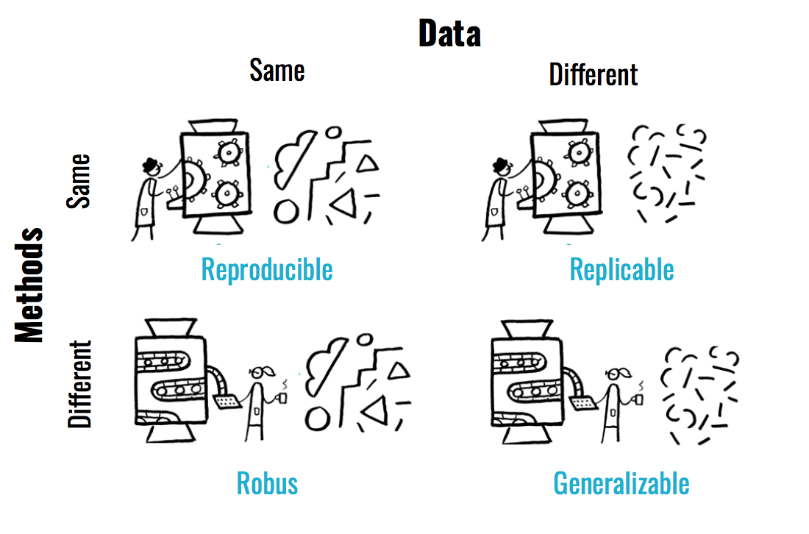

```{r setup, include=FALSE}
knitr::opts_chunk$set(echo = TRUE)
```


```{r echo=FALSE, message=FALSE}
library(here)
library(ggplot2)
```

# This is a heading

This is some sample text. This could go on and on for a long time. I will repeat this sentence, to produce some more text. I will repeat this sentence, to produce some more text. I will repeat this sentence, to produce some more text. I will repeat this sentence, to produce some more text. I will repeat this sentence, to produce some more text. I will repeat this sentence, to produce some more text. I will repeat this sentence, to produce some more text. I will repeat this sentence, to produce some more text. I will repeat this sentence, to produce some more text. Let me try out if I can make this into a new paragraph. 

Great, yes, I can. 

## This is a subheading

...with some more sample text.

## This is a subheading

...with some more sample text.

# Read in Data

```{r }
# read in data
questionnaire = read.csv(here('data/baker2016-edited.csv'))
```

We could add some txt here talking about what kind of data we are using. Then we show the data overview:

```{r }
knitr::kable(
  head(questionnaire), # This is the table we will plot
  booktabs = TRUE, # We determine the formatting style as 'booktabs'
  caption = 'A table that now looks much prettier.') # Here we are adding a caption 
```

This is some sample text. This is some sample text. This is some sample text. This is some sample text. This is some sample text. This is some sample text. This is some sample text. This is some sample text. This is some sample text. This is some sample text.

# Plotting

Plotting the data:

```{r eval = F}
library(ggplot2)
ggplot(questionnaire, aes(x=crisis_agree, fill = crisis_agree))+
  geom_bar(aes(y = (..count..)/sum(..count..)))+
  ylab('Percentage')+
  coord_flip()+
  theme_bw()+
  theme(legend.title = element_blank(), 
        axis.title.x = element_blank())
```

 This is some sample text. This is some sample text. This is some sample text. This is some sample text. This is some sample text. This is some sample text. This is some sample text. This is some sample text. This is some sample text. This is some sample text.
 
Now I could an image:


{width=40%}

