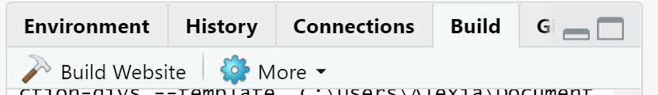
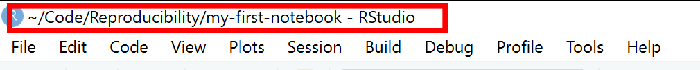
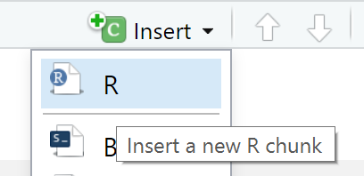
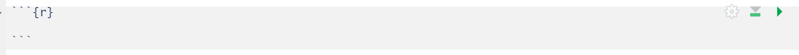

# RStudio

We will be using RStudio both for this Rmarkdown session and also during the GitHub session.  RStudio is currently a very popular Integrated Development Environment (IDE) for working with R.  An IDE is an application used by software developers that faciliates programming by offering source code editing, building and debugging tools all integarated into one application.  To function correctly, RStudio needs R and therefore both need to be installed on your computer.

The RStudio Desktop open-source product is free under the
[Affero General Public License (AGPL) v3](https://www.gnu.org/licenses/agpl-3.0.en.html).  [Other versions of RStudio](https://www.rstudio.com/products/rstudio/) are also available.

We will use RStudio IDE to write code, navigate the files on our computer,
inspect the variables we are going to create, and visualize the plots, tables and the notebooks that we will
generate. RStudio can also be used for version control and we will be looking at this later on.


RStudio is divided into 4 "Panes": the **Source** for your scripts and documents
(top-left, in the default layout), your **Environment/History/Build/Git** (top-right),
your **Files/Plots/Packages/Help/Viewer** (bottom-right), and 
the R **Console** (bottom-left). The placement of these
panes and their content can be customized (see menu, Tools -> Global Options ->
Pane Layout). 

One of the advantages of using RStudio is that all the information
you need to write code is available in a single window. Additionally, with many
shortcuts, autocompletion, and highlighting for the major file types you use
while developing in R, RStudio will make typing easier and less error-prone.

\ 

# Creating an Rmarkdown project

Before starting to write code in RStudio, we need to create an R Project.  The idea behind an R project is  to have a workspace where you can keep all the files and settings associated with the project together.  In that way, next time you open the R Project it would be easier to resume work.  To create an R notebook project for the web in RStudio follow the following steps:

1. `File` -> `New Project` -> `New Directory` -> `Simple Rmarkdown website`.
2. Specify where you would like to create your project.  This would be your **working directory**.  
3. Click `Create Project`.

RStudio automatically generates a template for you to develop further.  To see how this template would look as a website, click on the `Build` tab on the top right hand side pane of RStudio and then click `Build Website`.  



RStudio's default preferences generally work well, but saving a workspace to
`.RData` can be cumbersome, especially if you are working with larger datasets as this would save all the data that is loaded into R into the `.RData` file.  
To turn that off, go to `Tools` -> `Global Options` and select the 'Never' option
for `Save workspace to .RData' on exit.`


\  

## Working directory

Whenever we are working on a project in RStudio, it is good practice to keep a set of related files *e.g.,* data, images, and code, self-contained in a single folder, called the **working directory**. All of the scripts within this folder can then use **relative paths** to files in the working directory that indicate where inside the project a file is located (as opposed to **absolute paths**, which point to where a file is on a specific computer). Working this way makes it
a lot easier to move your project around on your computer and share it with others without worrying about whether or not the underlying scripts will still work.  

> **Absolute vs Relative paths examples**
> 
> **Relative path**: data/dataset1.txt
>
> **Absolute path**: C:/Users/User1/Documents/R/my-first-project/**data/dataset1.txt**

Using RStudio projects makes it easy to organise your files in the project and ensures that your working directory is set properly.  RStudio shows your current working directory at the top of your window:


Another way to check your working directory is by typing `getwd()` in the console pane. If for some
reason your working directory is not what it should be, you can change it in the
RStudio interface by navigating in the file browser where your working directory
should be, and clicking on the blue gear icon `More`, and select `Set As Working
Directory`. Alternatively you can type `setwd("/path/to/working/directory")` in the console to
reset your working directory (not recommended). However, your scripts should not include this line
because it will fail on someone else's computer.

Using a consistent folder structure across your projects will help keep things
organized, and will also make it easy to find things in the future. This
can be especially helpful when you have multiple projects. In general, you may
create directories (folders) for **data**, and **images**.

 - **`data/`** Use this folder to store your raw data and intermediate
   datasets you may create for the need of a particular analysis. For the sake
   of transparency and [provenance](https://en.wikipedia.org/wiki/Provenance),
   you should *always* keep a copy of your raw data accessible and do as much
   of your data cleanup and preprocessing programmatically (*i.e.,* with scripts,
   rather than manually). Separating raw data from processed data
   is also a good idea. For example, you could have files
   `data/raw/survey.plot1.txt` and `data/raw/survey.plot2.txt` kept separate from
   a `data_output/survey.csv` file generated by the
   `scripts/01.preprocess.survey.R` script.
 - **`img/`** This would be a place to keep figures that you would like to display in your notebook.
 - **`scripts/`** This would be the location to keep your R scripts for
   different analyses or plotting.

You may want additional directories or subdirectories depending on your project
needs, but these should form the backbone of your working directory.

The working directory is an important concept to understand. It is the place
from where R will be looking for and saving the files. When you write code for
your project, it should refer to files in relation to the root of your working
directory and only need files within this structure.

\

# Rmarkdown

An Rmarkdown file is made up of 3 basic components:

  - header
  - markdown
  - R code chunks
  
In this course we will assume that the output of our report is an .html file.  HTML files are files for web pages.  This means that the report that we will generate can be easily deployed on the web.  

  
## Rmarkdown header

The markdown document starts with an optional header in YAML format known as the YAML metadata.  In the example below the title, author and date are specified in the header.  Other options can be specified in the header such as table of content which we will look at later on in the course.  

```
---
title: "My first notebook"
author:  Alexia Cardona
date: 18 February 2020
---
```

> **Hint**
>
> Press the  button to see how the report will look like after you make changes to the .Rmd file. 

\  

## Markdown {#markdown-header}

The text following the header in an Rmarkdown file is in Markdown syntax.  This is the syntax that gets converted to HTML format once we click on the Knit button or the Build website button.  The philosophy behind Markdown is that it should be easy to write and easy to read.  

The full documentation of the Markdown syntax can be found at https://pandoc.org/MANUAL.html.  However this can be a bit difficult to follow for beginners, therefore below is a simplified version of the Markdown syntax.

\  

### Headings

Below is the `Markdown code` you need to use to specify headings at different levels and the rendered output respectively below the code:

`# Heading 1`

<p style="font-weight:500; font-size:34px">Heading 1</p>

`## Heading 2`

<p style="font-weight:500; font-size:30px">Heading 2</p>


`### Heading 3`

<p style="font-weight:500; font-size:24px">Heading 3</p>

`#### Heading 4`

<p style="font-weight:500; font-size:18px">Heading 4</p>

\  

### Inline text formatting

To make text **bold** use `**double asterisks**` or `__double underscores__`.  
To make text *italic* use `*asterisks*` or `_underscores_`.  
To make text ^superscript^ use `^caret^`.  
To make text ~subscript~ use `~tilde~`.  
To mark text as `inline code` use `` `backticks` ``.   
To  ~~strikethrough~~ text use `~~double tilde~~`.

\

### Line breaks
To create a line break, put more than 2 spaces at the end of a sentence or place `\` in a new line followed by a new line .  

\

### Links

#### Linking text to Headers

To link text to a header you would need to specify an identification tag next to a header as follows:

`# Markdown {#markdown-header}`

Then to link text to this header use `[link to header](#markdown-header)`.  This will be rendered as [link to header](#markdown-header).

\


#### Linking text to a webpage

To create a link to a webpage use `[text of link](https://training.cam.ac.uk/bioinformatics/event-timetable)`.  This is rendered as [text of link](https://training.cam.ac.uk/bioinformatics/event-timetable). 

\

#### Footnotes

To indicate a footnote use`[^1]` and, for example, indicate another one as`[^2]` and then specify the wordings of the footnotes as:

`[^1]: This is the first footnote.`  
`[^2]: This is the second footnote.`

You do not need to put footnotes at the end of the document for them to be rendered there.  This example is rendered as follows:  

To indicate a footnote use[^1] and, for example, indicate another one as[^2] and then specify the wordings of the footnotes as:

[^1]: This is the first footnote.  
[^2]: This is the second footnote.

\


### Lists

#### Ordered lists

To create an ordered list use the following syntax:

```
1. Item 1
2. Item 2
3. Item 3
```

This is rendered as:

1. Item 1
2. Item 2
3. Item 3

Use 4 spaces to indent an item if you would like to have sub-lists:
```
1. Item 1
2. Item 2
3. Item 3
    a. Item 3a
        i.  Item 3ai
        ii. Item 3aii
    b. Item 3b
    c. Item 3c
4. Item 4
```

1. Item 1
2. Item 2
3. Item 3
    a. Item 3a
        i.  Item 3ai
        ii. Item 3aii
    b. Item 3b
    c. Item 3c
4. Item 4

\

#### Unordered lists

In an unordered bulletted list, each item begins with `*`, `+` or `-`.  Example:

```
* Item 1
* Item 2
* Item 3
    * Item 3a
        *  Item 3ai
        * Item 3aii
    * Item 3b
    * Item 3c
* Item 4
```
Will be rendered as:

* Item 1
* Item 2
* Item 3
    * Item 3a
        *  Item 3ai
        * Item 3aii
    * Item 3b
    * Item 3c
* Item 4

\  

#### Tasks list

Tasks list can be done using the following syntax:

```
- [ ] an unchecked task list item
- [x] checked item
```

This will be rendered as:

- [ ] an unchecked task list item
- [x] checked item

\

### Inserting images
To insert an image use the following syntax: ``.  Example:

``

Will be rendered as:


\

### Tables {#tables}

Use `|`and `-` to create a table as follows:

```
| Column 1    | Column 2    |
| ----------- | ----------- |
| Item 1,1    | Item 1,2    |
| Item 2,1    | Item 2,2    |
```
This is rendered as:

| Column 1    | Column 2    |
| ----------- | ----------- |
| Item 1,1    | Item 1,2    |
| Item 2,1    | Item 2,2    |

Table alignments can be done using the following syntax:

```
| Left align  | Center align | Right align  |
| :---        |    :----:    |         ---: |
| Item 1,1    | Item 1,2     | Item 1,3     | 
| Item 2,1    | Item 2,2     | Item 2,3     |
```
This is rendered as:

| Left align  | Center align | Right align  |
| :---        |    :----:    |         ---: |
| Item 1,1    | Item 1,2     | Item 1,3     | 
| Item 2,1    | Item 2,2     | Item 2,3     |

\

### Blocks
Blocks in the notebook can be created by using the `>` sign as follows:
`> Example of a block`

This is rendered as:

> Example of a block


If you would like to add **code blocks**, use ` ``` ` before and after the code as follows:


~~~
```
print("Hello world")
x <- 1+2
print(x)
```
~~~


This will be rendered as:
```
print("Hello world")
x <- 1+2
print(x)
```
\

### Adding a table of contents

To add a table of contents to your report add the following to the YAML header:

```
output:
  html_document:
    toc: true
```

By default all headings up to level 3 headings are displayed in the table of contents.  You can adjust this by specifying `toc_depth` as following:

```
output:
  html_document:
    toc: true
    toc_depth: 4
```
\

### Adding references

Adding references and citations in Markdown is not as easy as reference manager software such as Mendeley. To be able to create citations you will need to create a bibliography file with all the references in it.  Here is an [example of a bibliography file](references.bib).  The bibligraphy file has to be placed in the same folder as the one where the `.Rmd` file is.  Next, add the following to the YAML header:

```
bibliography: references.bib
link-citations: yes
```
Your YAML header should now look like:
```
---
title: "My first notebook"
author:  Alexia Cardona
date: 18 February 2020
bibliography: references.bib
link-citations: yes
---
```

To cite a reference use the `@` together with the ID of the reference.  Example:

`Citation to my paper @cardona2014 and @cardona2019`

Will be rendered as:

Citation to my paper @cardona2014 and @cardona2019

To add the bibliography at the end of the report add a References heading at the end of the report:

`# References`

See [references](#refs) at the end of the report.


See https://rmarkdown.rstudio.com/authoring_bibliographies_and_citations.html for more information.  

\

## R code chunks

So far we have not used any R code and all the code we used so far is in Markdown.  As the name suggests, Rmarkdown files contain markdown and R.  Rmarkdown files have a `.Rmd` extention.  Using R in a markdown document makes sense if we integrate our analysis in our report. Some operations that we might need to do are; loading our dataset, performing some operations on the dataset and displaying results, either in a table or in a plot.  We will be doing all this in the following sections.

If you would like to insert R code inside the notebook you will have to insert it inside an R code chunk to be able to execute it.  To do this either click on the `Insert` button at the top of the Source panel in RStudio:



This creates an **R code chunk** as follows:


Alternatively, you can type the r code chunk.  The R code should be placed in between the triple backticks.  Note that on the right hand side of the R code chunk there is a green "play" button that will run the R code chunk if pressed.  By default, when the Rmarkdown document is knitted, the R code will be executed and the R code chunk is displayed before the executed code.  

[Click here](RNotebookExample.Rmd) for an example of an R Notebook.  The sections below will go over the differet parts of the R Notebook.  Add RNotebookExample.Rmd to your existing R project.  

\  

### The dataset

[RNotebookExample.Rmd](RNotebookExample.Rmd) uses data from [gapminder](https://www.gapminder.org/).  Let us download the `gapminder_data.csv` dataset into our project.  Create a `data` folder in your working directory.  Download the dataset into the `data` folder as follows:

```
download.file(url="https://raw.githubusercontent.com/cambiotraining/reproducibility-training/master/data/gapminder_data.csv", destfile="data/gapminder_data.csv")
```

The `gapminder_data.csv` dataset that is loaded into the notebook contains the life expectancy and GDP per capita  data for each country per year from 1952 to 2007.  The dataset has the following columns:  

| Column           | Description                                               |
|------------------|-----------------------------------------------------------|
| country          | Country                                                   |
| year             | Year the life expectency and GDP per capita index applies |
| pop              | Population size                                           |
| continent        | Continent                                                 |
| lifeExp          | Life expectancy                                           |
| gdpPercap        | GDP per capita index                                      |

The dataset contains data for different countries in the world.  For our analysis we would like to look at only the European countries in the dataset.  This means that we would need to manipulate the dataset before we can display the results.  

\  

### Chunk options

As mentioned, by default the chunk output will be displayed exactly after the R code chunk and the R code chunk is also displayed in the rendered page.  If you would like to have different settings, you can specify these as arguments in the `{}` part of the R code chunk.

These chunk options include:

* `include = FALSE` do not display the code and results in the page after it is knitted.  The R code however still runs and therefore the variables or results in this code chunk can be used by the other chunks.  
* `echo = FALSE` does not display the code, but it displays the results in the rendered file.  
* `message = FALSE` does not display any messages that are generated by the code chunk in the rendered file.
* `warning = FALSE` does not display warnings that are generated by code chunk in the rendered file.

A full list of options that can be used in the R code chunks is found [here](https://www.rstudio.com/wp-content/uploads/2015/03/rmarkdown-reference.pdf).

\

### Tables in Rmarkdown

When you have a large dataset, creating a table manually in rmarkdown as we did [here](#tables) is not really feasible.  Also if you are really trying to make your research reproducible, then, you will need to generate most of the tables dynamically and therefore you will not be able to manually type them in markdown.  This is where Rmarkdown comes in as there is a way to display tables dynamically.  In [RNotebookExample.Rmd](RNotebookExample.Rmd), the data was first loaded and then after some manipulation, the table was displayed by using the `kable` function and passing in the table variable as its argument. More information about `kable` can be found in its [documentation](https://cran.r-project.org/web/packages/kableExtra/vignettes/awesome_table_in_html.html).

If you have a very long table to display, the best way would be to use pagination where the contents of the table are split into multiple tabs.  The function `paged_table` in the `rmarkdown` library can be used to do this (see example in [RNotebookExample.Rmd](RNotebookExample.Rmd)).

\  

# Summary

Through R notebooks we can now integrate our R code and our results in one readable document that we can share with our collaborators.  In this way the code and the results have become one item. For inspiration, examples of R notebooks can be found at https://rpubs.com/

**Limitations:**

Some limitations that Rmarkdown has:

* Figure and table numbering is not supported.  There is still a way around this, by using third-party packages *e.g.,* [captioner](https://cran.r-project.org/web/packages/captioner/vignettes/using_captioner.html).
*  If you are looking at specific customisations that are different from the default Markdown format, *e.g.,* headings using different font specifications, then this gets tricky and markdown might not be the best approach.  

\

# References {#refs}